## Summary

The schema is `db/schema.sql`, applied idempotently on start-up and each night (see [Idempotent schema](kb:adr-011-idempotent-schema)). The diagram and notes below are the original design record; tables added since (ETFs, search, accounts, the track record) are listed with every column in the generated [Data dictionary](kb:ref-data-dictionary), which is always current. Shared data has no owner; personal tables carry `owner_id` ([Accounts and owners](kb:accounts-owners)).

### Database Design (`db/schema.sql`)

### Entity-Relationship Diagram

```mermaid
erDiagram
    companies ||--o{ daily_prices : has
    companies ||--o{ financial_reports : has
    companies ||--o{ valuation_metrics : has
    companies ||--o{ dividend_payments : has
    companies ||--o{ signal_snapshots : has
    signal_snapshots ||--o{ signal_outcomes : "scored as"
    portfolios ||--o{ holdings : holds
    watchlists ||--o{ watchlist_items : lists
    companies ||--o{ watchlist_items : "watched as"

    companies {
        uuid company_id PK
        varchar ticker UK "e.g. BHP.AX"
        varchar company_name
        varchar sector
        varchar industry
        varchar asx_code UK "e.g. BHP"
        boolean is_active
        timestamptz created_at
        timestamptz updated_at
        varchar country "Yahoo domicile; drives franking"
        varchar trading_currency "share price currency, AUD on the ASX"
        varchar financial_currency "currency statements are published in"
    }
    dividend_payments {
        uuid company_id PK,FK
        date ex_date PK "ex-dividend date"
        numeric amount "per share, trading currency"
        boolean abnormal "one-off held out of dividend figures"
    }
    daily_prices {
        uuid price_id PK
        uuid company_id FK
        date price_date
        numeric close_price
        bigint volume
        numeric market_cap
        timestamptz created_at
    }
    financial_reports {
        uuid report_id PK
        uuid company_id FK
        int fiscal_year
        varchar period_type "FY | H1 | H2"
        date report_date
        numeric revenue
        numeric ebit
        numeric net_profit_after_tax
        numeric operating_cash_flow
        numeric free_cash_flow
        numeric capital_expenditure
        numeric eps
        numeric total_assets
        numeric total_liabilities
        numeric total_equity
        numeric total_debt
        numeric cash_and_equivalents
        numeric net_tangible_assets
        numeric dividends_per_share "ordinary, per financial year"
        numeric abnormal_distributions_per_share "one-offs held out"
        varchar reporting_currency "statements converted from this"
        numeric fx_rate "rate applied at balance date"
        numeric franking_percentage "default 100.0"
        numeric corporate_tax_rate "default 30.0"
        timestamptz created_at
    }
    valuation_metrics {
        uuid valuation_id PK
        uuid company_id FK
        date as_of_date
        numeric pe_ratio
        numeric pb_ratio
        numeric price_to_fcf
        numeric ev_to_ebit
        numeric roe
        numeric roic
        numeric debt_to_equity
        numeric current_ratio "always NULL - see 8.1"
        numeric uncapped_dividend_yield
        numeric grossed_up_dividend_yield
        numeric payout_ratio "added 2026-10-02, flags special dividends"
        numeric dcf_intrinsic_value
        numeric graham_number
        numeric margin_of_safety_percent
        varchar valuation_method "added 2026-10-02: 'DCF' or 'DDM', see 8.5/known-issue 8"
        numeric margin_of_safety_trend "added 2026-10-02: see 8.6/known-issue 17"
        varchar fundamentals_trend "added 2026-10-02: IMPROVING/STABLE/DECLINING, see 8.6"
        numeric cash_conversion "decision marker, see 8.7"
        varchar earnings_quality "STRONG/ADEQUATE/WEAK"
        numeric price_vs_200d "decision marker, see 8.7"
        numeric range_position_52w "0-100"
        varchar dividend_trend "GROWING/STEADY/CUT/NONE"
        varchar data_confidence "HIGH/MEDIUM/LOW"
        timestamptz created_at
    }
    holdings {
        uuid holding_id PK
        varchar asx_code "joined to companies.asx_code, no FK - see 19"
        numeric units
        varchar acquisition_method "PURCHASE/DRP/BONUS/TRANSFER/OTHER"
        date buy_date
        numeric buy_price
        numeric buy_brokerage
        date sell_date "NULL while held"
        numeric sell_price
        numeric sell_brokerage
        varchar broker
        text notes
        uuid split_from_id FK "self-reference for partial sales"
        uuid portfolio_id FK "NOT NULL, ON DELETE RESTRICT"
    }
    watchlist_items {
        uuid watchlist_id PK,FK "ON DELETE CASCADE"
        uuid company_id PK,FK "ON DELETE CASCADE"
        text note
        numeric mos_above "trigger"
        numeric price_below "trigger, > 0"
    }
    portfolios {
        uuid portfolio_id PK
        varchar name UK
        varchar tax_type "INDIVIDUAL/TRUST/SMSF/COMPANY"
        timestamptz archived_at "NULL while active"
    }
    signal_snapshots {
        uuid company_id PK,FK
        date snapshot_date PK "the price date the valuation used"
        numeric price
        varchar action
        boolean held
        varchar valuation_status
        numeric margin_of_safety_percent
        numeric estimated_value
        smallint score_total "plus one column per spoke"
        boolean mos_ok "plus roe_ok, de_ok, yield_ok"
        text_array red_flags
        varchar rules_version
    }
```

### Constraints of Note

- `companies.ticker` and `companies.asx_code` are both `UNIQUE`
- `holdings.portfolio_id` is `NOT NULL` and `ON DELETE RESTRICT`: a portfolio can't be deleted out from under its parcels at the database level; `delete_portfolio()` removes open parcels first and refuses outright once there are sales ([§19.1](kb:portfolios-cgt))
- `signal_snapshots` has `PRIMARY KEY (company_id, snapshot_date)`, and the recorder inserts with `ON CONFLICT DO NOTHING`: a date once recorded is never rewritten ([§21](kb:track-record))
- `daily_prices` has a `UNIQUE (company_id, price_date)` constraint, one price per company per day, and the upsert logic in `price_ingestion.py` relies on this as its conflict target
- `financial_reports` has a `UNIQUE (company_id, fiscal_year, period_type)` constraint and a `CHECK (period_type IN ('FY', 'H1', 'H2'))`
- `valuation_metrics` has `UNIQUE (company_id, as_of_date)`, one valuation snapshot per company per day
- All foreign keys are `ON DELETE CASCADE`, deleting a company deletes all its prices/reports/valuations
- Indexes: `idx_companies_asx`, `idx_daily_prices_date`, `idx_financials_year` (all `IF NOT EXISTS`, safe to re-run)

### `asx_value_screener` View

A `CREATE OR REPLACE VIEW` joining each active company to its **latest** `daily_prices` row and **latest** `valuation_metrics` row (via correlated `MAX(...)` subqueries). This is what `screen_asx.py` queries directly, it never queries the base tables. Columns exposed: `asx_code, company_name, sector, current_price, pe_ratio, pb_ratio, roe, debt_to_equity, grossed_up_dividend_yield, dcf_intrinsic_value, graham_number, margin_of_safety_percent, payout_ratio`.

**Hard-won `CREATE OR REPLACE VIEW` constraint, worth remembering for any future column addition:** PostgreSQL only allows appending new columns at the **end** of an existing view's column list, it cannot insert a column in the middle, even though the underlying `SELECT` is otherwise free to change. Placing `payout_ratio` between `grossed_up_dividend_yield` and `dcf_intrinsic_value` (its more "logical" position) failed with `ERROR: cannot change name of view column "dcf_intrinsic_value" to "payout_ratio"` when tested against a database that already had the view from before this column existed, caught in testing, before it ever reached the live database, by simulating exactly that upgrade path. `payout_ratio` is appended at the end of the `SELECT` instead; this has no effect on CLI output order since `screen_asx.py` selects columns by name, not position.

### Known Schema Fix Applied

The original schema draft used `TIMESTAMP WITH TIMEZONE`, which is **not valid PostgreSQL** (the correct type is `TIMESTAMP WITH TIME ZONE`). This was corrected across all four tables before the schema was ever applied, see commit `d60ef53`. Confirmed by running the corrected script against a live PostgreSQL 16 instance with zero errors, twice (to prove idempotency).

### ORM Layer (`src/models/`)

Standard SQLAlchemy 2.0 declarative models, one file per table, mapped **column-for-column** to `db/schema.sql` (verified by direct insert/round-trip testing against a live database, see [§10](kb:testing-and-validation)).

**Design pattern used:** relationships are declared via string forward references (e.g. `Mapped[list["DailyPrice"]]`) rather than direct imports, to avoid circular imports between `company.py` and the three child models. This means **models must always be imported via `from src.models import ...`** (which imports `src/models/__init__.py`, registering every model class with SQLAlchemy's mapper registry), importing a submodule directly (e.g. `from src.models.company import Company`) in isolation, before the other modules have been imported, will fail when the relationship is first resolved.

All `TIMESTAMP WITH TIME ZONE` columns map to `DateTime(timezone=True)` with `server_default=func.current_timestamp()`.
