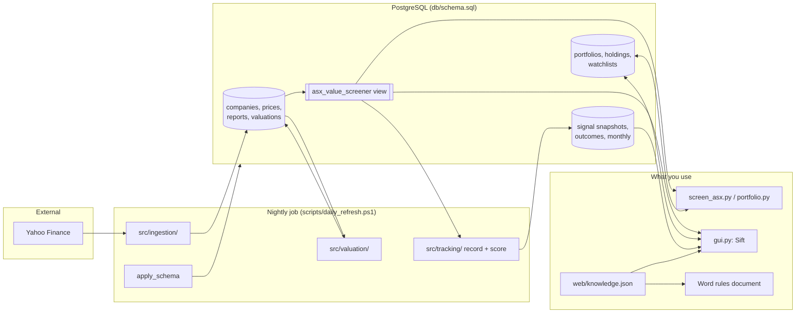

## Summary

Read this first. It describes Sift as a whole; [Architecture](kb:architecture) explains how the running parts fit together, and the feature articles go deep on each part. Status figures quoted below are as recorded at the time; the current version and release notes are on the knowledge base home page.

### Executive Summary

This system is a local ASX (Australian Securities Exchange) value-investing research tool, with a web interface called **Sift**. Each night it ingests prices and annual financial statements for about 500 ASX companies from Yahoo Finance, values every company (a two-stage discounted cash flow model, or a dividend discount model for banks, insurers and REITs), and computes the classic ratios, the franking-adjusted dividend yield, the Graham Number and the margin of safety. Every company is tested against four Graham/Buffett-style value tests, checked for quality and trend markers and red flags, scored on a 30-check score wheel, and given a suggested action with its reason (§8, [§9](kb:screener-actions)).

Around that core:
- **Sift** ([§20](kb:web-gui)) shows it all in a browser, on a PC or a phone at home: a dashboard of what needs attention and what changed overnight, a filterable screener, a page per company with charts, and a searchable **Help** page ([§23](kb:help-knowledge-base)).
- **Portfolios** ([§19](kb:portfolios-cgt), [§19.1](kb:portfolios-cgt)) keep parcel-level CGT records across several portfolios, each with its owner's tax type, with trades entered in the browser or at the command line.
- **Watchlists** ([§22](kb:watchlists)) follow companies without owning them, with notes and price or value triggers.
- **Track record** ([§21](kb:track-record)) records what Sift said every night and scores it after 1, 3, 6 and 12 months against the average screened company, so the rules are judged on results.
- **Knowledge base** ([§23](kb:help-knowledge-base)): one file, `web/knowledge.json`, supplies the Help page, every hover explanation and the glossary of the Word rules document.
- **ETFs** ([§25](kb:etfs-collection)): every ASX exchange traded fund collected alongside the shares: its fund facts monthly from the ASX's own report, prices and distributions nightly with full history, and Sift's own total returns from 1 month to 10 years. Not valued or scored as companies. Sift shows them under their own heading, apart from shares: an ETF screener and page per ETF, and separate ETF sections on the dashboard, in portfolios and in watchlists ([§26](kb:etfs-presentation)).
- **LICs** ([§27](kb:lics)): listed investment companies and trusts under their own heading, judged on the share price against net tangible assets (NTA), from the same ASX report.
- **Admin console** ([§24](kb:admin-console)): every setting, formula and threshold in one registry, shown with its Help entry; every company figure shown step by step; and what-if scenarios that compare different settings with live on today's data without changing anything live.

**Status as at 2026-10-06:** in daily use on the user's Windows PC, refreshed by Windows Task Scheduler at 6 pm ([§16](kb:nightly-run)), against a live PostgreSQL database of about 500 companies. All four stages of the Sift build (menu bar and dashboard, portfolios, watchlists, track record), the knowledge base and the admin console (phases 1 and 2) are complete, and stages 1 and 2 of ETFs (collection, and presenting them apart from shares) are built, as are LICs ([§27](kb:lics)). 556 automated tests pass ([§10.14](kb:testing-and-validation)). Yahoo Finance is blocked from the development environment, so live ingestion is exercised only on the user's PC ([§10.7](kb:testing-and-validation)). The track record's first results arrive about a month after recording began.

**Architecture:**



### Repository Structure

```
Portfolio/
├── db/
│   └── schema.sql                      PostgreSQL DDL, source of truth for the data model
├── src/
│   ├── config.py                       DB connection resolution (env-var driven)
│   ├── settings.py                     Every adjustable setting: live values, ranges, formulas, guard rails (§24)
│   ├── models/                         SQLAlchemy 2.0 ORM layer
│   │   ├── base.py                     Declarative Base
│   │   ├── company.py                  Company model + relationships
│   │   ├── daily_price.py              DailyPrice model
│   │   ├── dividend_payment.py         DividendPayment model - one row per ex-dividend date (§20)
│   │   ├── financial_report.py         FinancialReport model
│   │   ├── holding.py                  Holding model - one share parcel (§19)
│   │   ├── portfolio.py                Portfolio model - a named owner with a tax type (§19.1)
│   │   ├── watchlist.py                Watchlist and WatchlistItem models (§22)
│   │   ├── signal_snapshot.py          SignalSnapshot model - what Sift said each night (§21)
│   │   ├── etf.py                      EtfMonthly and EtfPerformance models (§25)
│   │   ├── scenario.py                 Scenario model - a saved what-if: name, notes, changed settings (§24)
│   │   └── valuation_metric.py         ValuationMetric model
│   ├── ingestion/                      Yahoo Finance → database
│   │   ├── yahoo_client.py             yfinance wrapper, all external I/O isolated here
│   │   ├── common.py                   get_or_create_company(), ensure_profile() shared helpers
│   │   ├── dividend_history.py         Ordinary dividends per financial year, abnormal one-offs held out (§7.6)
│   │   ├── currency.py                 Converts statement figures into the share price's currency (§7.7)
│   │   ├── price_ingestion.py          Upserts daily_prices
│   │   ├── fundamentals_ingestion.py   Upserts financial_reports
│   │   └── run_ingestion.py            CLI entrypoint
│   ├── valuation/                      Financial calculations + orchestration
│   │   ├── dividends.py                Grossed-up (franked) dividend yield
│   │   ├── graham.py                   Graham Number
│   │   ├── dcf.py                      2-stage discounted cash flow (most sectors)
│   │   ├── ddm.py                      2-stage dividend discount model (Financial Services / Real Estate)
│   │   ├── markers.py                  Earnings quality, price position, dividend reliability, data confidence (§8.7)
│   │   ├── engine.py                   Pulls DB inputs together, picks DCF vs DDM by sector, upserts
│   │   └── run_valuation.py            CLI entrypoint
│   ├── portfolio/                      Your holdings (§19)
│   │   ├── cgt.py                      Australian CGT arithmetic: cost base, 12-month discount, FY summary
│   │   ├── holdings.py                 Portfolios; parcel add/sell (with splitting)/delete/undo sale; position summaries
│   │   ├── views.py                    Portfolio figures for the web GUI: totals, positions, parcels, CGT by year (§19.1)
│   │   └── trade_input.py              Checks on trades typed into the browser, with plain-English errors (§19.1)
│   ├── admin/                          Admin console (§24)
│   │   ├── scenarios.py                What-if runs on cached inputs, live vs scenario comparison, saving
│   │   └── workings.py                 A company's figures step by step, and the sensitivity grid
│   ├── etf/                            ETFs (§25)
│   │   ├── asx_report.py               Finds, downloads and reads the ASX Investment Products report; loads the ETF list
│   │   ├── prices.py                   Nightly ETF prices and distributions, full history the first time
│   │   ├── performance.py              Total returns 1 month to 10 years, trailing yield, check against the report
│   │   ├── views.py                    ETF screener rows, an ETF's page, category averages, reference fund (§26)
│   │   └── run_etfs.py                 CLI entrypoint; nightly step 1b (§16); --inspect, --report
│   ├── apply_schema.py                 Applies db/schema.sql via .env; nightly step 0 (§16)
│   ├── screening/
│   │   ├── actions.py                  Suggested action + reason per company (§9.1)
│   │   ├── enriched.py                 Screener rows + scores + valuation status, shared by GUI and tracking (§21)
│   │   └── scores.py                   Score wheel: 5 axes x 6 yes/no checks (§20)
│   ├── watchlist/
│   │   └── lists.py                    Watchlists: names, entries with notes and triggers, trigger checks (§22)
│   └── tracking/                       Prediction track record (§21)
│       ├── signals.py                  Nightly signal snapshots, action changes, recording status
│       ├── record_signals.py           CLI entrypoint; nightly step 3 (§16)
│       ├── outcomes.py                 Scores signals at 1/3/6/12 months, monthly summary, 14-month deletion
│       ├── score_signals.py            CLI entrypoint; nightly step 4 (§16)
│       └── report.py                   Track record page: verdict, order check, missed, saved, still actionable
├── screen_asx.py                       Root-level CLI: the value screener
├── portfolio.py                        Root-level CLI: record parcels, list positions, CGT report (§19)
├── gui.py                              Root-level web GUI server: FastAPI over the screener's own loader (§20)
├── web/                                index.html, style.css, app.js - the GUI front end, no build step (§20)
│   └── knowledge.json                  The knowledge base: Help page, hover explanations, Word glossary (§23)
├── requirements.txt                    Pinned dependency versions
├── requirements-dev.txt                requirements.txt + pytest (§10.12)
├── pytest.ini                          Test discovery config (testpaths, pythonpath, integration marker)
├── .env.example                        Template for local DB credentials
├── .gitignore                          Excludes .venv/, __pycache__/, .env, logs/, watchlist files
├── README.md                           Setup + workflow quick-start
├── scripts/
│   ├── daily_refresh.ps1               Windows Task Scheduler automation (§16)
│   ├── build_rules_doc.js              Builds the Word rules document; glossary from web/knowledge.json (§23)
│   └── package.json                    The builder's one dependency (docx 9.8.1)
├── tests/                              pytest suite (§10.12, IMP-006)
│   ├── conftest.py                     DB-reachability check, test-DB creation/schema apply, truncate-between-tests fixture
│   ├── unit/                           No database - pure functions + compute_metrics()
│   │   ├── _builders.py                In-memory Company/DailyPrice/FinancialReport/ValuationInputs factories
│   │   ├── test_dividends.py, test_graham.py, test_dcf.py, test_ddm.py
│   │   ├── test_engine.py              Sector routing, overflow clamping, trend fields - real historical regressions
│   │   ├── test_markers.py, test_cgt.py, test_actions.py
│   │   ├── test_dashboard.py           Nightly-log reading, stale-data weekday rule, valuation status
│   │   ├── test_knowledge.py           The knowledge base: IDs, links, hover labels, placeholders, glossary (§23)
│   │   ├── test_trade_input.py         Browser input checks, CGT discount by tax type, the cross-site write guard
│   │   ├── test_watchlist_triggers.py  Trigger thresholds and entry checks (§22)
│   │   ├── _etf_report.py              Builds spreadsheets shaped like the ASX report, in two layouts
│   │   ├── test_asx_report.py          Reading the ASX report: headings, groups, units, download fallbacks (§25)
│   │   ├── test_etf_views.py           Growth of $10,000, distributions by year, category averages (§26)
│   │   ├── test_etf_performance.py     Total returns, reinvestment, annualising, trailing yield (§25)
│   │   ├── test_yahoo_prices.py        Closes as traded, with splits and distributions (§25)
│   │   ├── test_settings.py            The settings registry: live values pinned, ranges, guard rails, modules read it (§24)
│   └── integration/                    Needs a real local PostgreSQL instance
│       ├── test_schema.py              Idempotent apply, view column coverage
│       ├── test_valuation_pipeline.py  gather_inputs/upsert/run_valuation crash isolation, markers end to end
│       ├── test_screener.py            build_query()/annotate_row() against the real view, held vs not-held actions
│       ├── test_portfolio.py           Parcel splitting, brokerage apportionment, sell order, guards
│       ├── test_ingestion.py           Franking by domicile, country backfill
│       ├── test_gui.py                 Web API payloads, dashboard and the password guard (§20)
│       ├── test_tracking.py            Signal snapshots: written once, stale valuations skipped, changes (§21)
│       ├── test_track_record.py        Scoring against made-up history, summary, deletion, report rules (§21)
│       ├── test_watchlists.py          Watchlist rules, API, and where watchlists show up (§22)
│       ├── test_lic_gui.py             LICs: reclassified from shares, NTA premium, sections, trigger rules (§27)
│       ├── test_etf_gui.py             ETF screener and page, ETFs apart in dashboard, portfolios, watchlists (§26)
│       ├── test_etfs.py                ETF loading, kept out of share screens, backfill, splits, performance (§25)
│       └── test_admin.py               Scenarios match live when unchanged, workings match the engine, admin API (§24)
└── docs/
    ├── AS_BUILT.md                     This document
    ├── OVERVIEW.md                     Plain-English summary: what, why, who
    └── ASX_Value_Screener_Rules_and_Methodology.docx   Every rule and threshold, with methodology and glossary
```

**Total custom code (2026-10-06):** about 8,500 lines across 62 Python files, 3,300 lines of web front end (`web/`) and 480 lines of SQL, plus `tests/`: 556 tests (426 unit, 130 integration) in 37 files, of which 104 are one text check per knowledge base entry. A coverage run puts the tested share of the code at 87% overall and 90% or more for everything added since 2026-10-05; the gaps are the Yahoo Finance network calls and the `run_ingestion` / `run_valuation` command wrappers ([§10.14](kb:testing-and-validation)).
